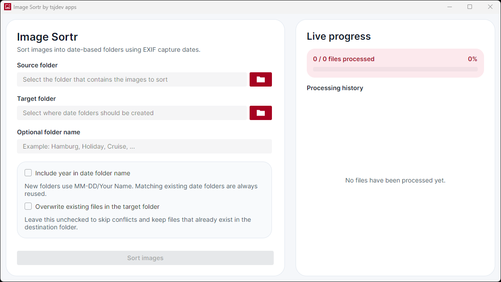
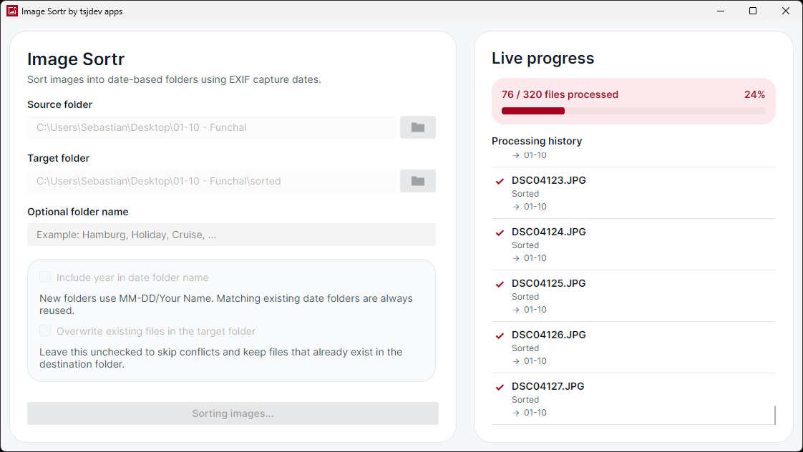
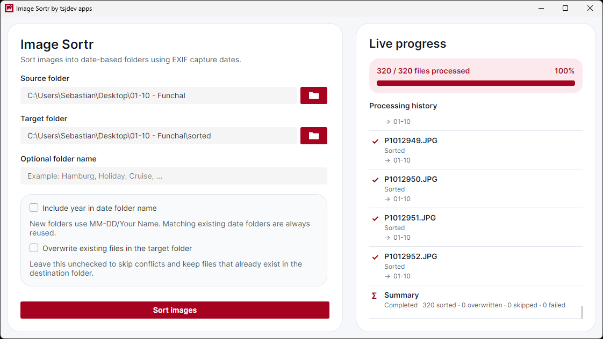

# Image Sortr

Image Sortr is a cross-platform desktop app for sorting entire folders of images into date-based folders without turning the task into a script. Built with Avalonia on .NET, it focuses on a practical batch workflow: choose a source folder, pick a target folder, optionally enter a folder name, choose whether to include the year, decide how conflicts should be handled, and copy organized images with a live per-file processing history.


The project is aimed at everyday image-organization jobs such as sorting travel photos, preparing camera exports for archival, separating mixed collections into date-based folders, or keeping image handoffs tidy for clients, friends, and family.

## Highlights

- Batch sort supported images from a desktop UI
- Read capture dates from EXIF metadata where available
- Fall back to file timestamps when metadata is missing
- Copy images into date-based folders without changing the originals
- Add an optional custom subfolder name to newly created date folders
- Choose whether new date folders include the year
- Reuse existing folders starting with `YYYY-MM-DD` or `MM-DD`
- Send images without a usable date to `Unknown Date`
- Skip or overwrite existing files
- Track every processed file with sorted, overwritten, skipped, or failed status details
- Keep the latest history entry visible automatically and clear the history before each new batch
- Write a localized result summary to the processing history when a batch completes
- Use English or German automatically based on the operating system UI language
- Follow the operating system light or dark appearance
- Support `.jpg`, `.jpeg`, `.png`, `.gif`, `.bmp`, `.tif`, `.tiff`, `.webp`, and `.avif`

> Note: the current sorting workflow processes files from the selected input folder only. It does not recurse into nested subfolders.

## Screenshots

### Batch setup



The main screen keeps the workflow simple: select a source folder, choose a target folder, optionally enter a subfolder name, decide whether the year belongs in new date folders, and choose how existing files should be handled.

### Live progress during a running batch



While the batch is running, Image Sortr shows the overall file count and percentage alongside a scrollable processing history. Each completed file appears immediately with a status icon and label, plus its destination folder or a short explanation where applicable. The history automatically keeps the newest entry visible.

### Completion summary



After the batch finishes, Image Sortr appends a compact summary to the processing history with sorted, overwritten, skipped, and failed counts. Starting another batch clears the previous history, summary, and progress values before new results are added.

## Localization and Appearance

Image Sortr includes English and German user interfaces. It selects the language from the operating system UI culture using standard .NET resource fallback:

- German cultures such as `de-DE`, `de-AT`, and `de-CH` use German.
- English cultures use English.
- Unsupported languages fall back to English.

The window follows the operating system light or dark theme. Both variants use the same Semi.Avalonia design language and application accent color.

## Sort Workflow

1. Select the folder that contains the source images.
2. Choose where the sorted copies should be written.
3. Optionally enter a name such as `Hamburg` or `Cruise` for a subfolder inside each date folder.
4. Decide whether new date folders should include the year and whether existing files should be overwritten.
5. Start the batch and follow the overall progress and per-file processing history.

Image Sortr reads files in deterministic, case-insensitive filename order. It copies files; the source folder is never renamed, moved, or otherwise modified.

## Folder Naming

Image Sortr determines a date in this order:

1. EXIF `DateTimeOriginal`
2. EXIF `DateTimeDigitized`
3. EXIF `DateTime`
4. File creation time
5. File last-write time

By default, newly created folders omit the year:

```text
<TargetFolder>/06-20/image.jpg
```

Select **Include year in date folder name** to create `YYYY-MM-DD` folders instead:

```text
<TargetFolder>/2026-06-20/image.jpg
```

When a custom folder name is provided, it is created inside the date folder:

```text
<TargetFolder>/06-20/Hamburg/image.jpg
```

Custom names are trimmed and sanitized for Windows, macOS, and Linux. If nothing safe remains, Image Sortr uses the date-only folder. If neither EXIF data nor a usable file timestamp is available, the image is copied into:

```text
<TargetFolder>/Unknown Date/image.jpg
```

## Existing Folder Matching

Before creating a date folder, Image Sortr looks in the target folder for an existing directory that starts with either the full date or month/day:

```text
2026-06-20
06-20
```

For example, a photo dated 2026-06-20 can reuse any of these folders:

```text
2026-06-20 - Cruise
2026-06-20 Hamburg
2026-06-20
06-20 - Cruise
06-20 Hamburg
```

When an optional name is provided, it is created or reused as a child directory inside the matching date folder. If several folders match, the app chooses deterministically: full-date matches first, then month/day matches, then ordinal case-insensitive alphabetical order.

## Supported Formats

Image Sortr currently accepts the following input file types:

- `.jpg`
- `.jpeg`
- `.png`
- `.gif`
- `.bmp`
- `.tif`
- `.tiff`
- `.webp`
- `.avif`

Capture-date EXIF metadata is most common in JPEG and TIFF images. Sorted output files keep their original names and extensions.

## Getting Started

### Prerequisites

- .NET SDK matching the version pinned in `global.json`

### Restore

```bash
dotnet restore ImageSortr.slnx
```

### Build

```bash
dotnet build ImageSortr.slnx --configuration Release
```

### Run the desktop app

```bash
dotnet run --project src/ImageSortr.App/ImageSortr.App.csproj --configuration Release
```

### Run the tests

```bash
dotnet test ImageSortr.slnx --configuration Release
```

There is no separate lint command. Repository analyzers and code-style checks run as part of the build.

The test projects use xUnit with Microsoft.Testing.Platform. The required runner is selected centrally in `global.json`, so the standard `dotnet test` command above is sufficient.

## Project Structure

- `src/ImageSortr.App`: Avalonia desktop UI shell, localized resources, light/dark theme, folder picker, processing-history models, and view model
- `src/ImageSortr.Core`: sorting pipeline, metadata dates, folder resolution, file handling, and result models
- `tests/ImageSortr.Tests`: xUnit tests for the sorting service, folder resolution, date fallback, and window view model

The solution intentionally keeps the UI thin. Avalonia-specific code lives in the app project, while the sorting workflow, validation, file handling, and progress reporting live in the core library.

## Tech Stack

- [.NET](https://dotnet.microsoft.com/)
- [Avalonia UI](https://avaloniaui.net/)
- [Semi.Avalonia](https://github.com/irihitech/Semi.Avalonia)
- [CommunityToolkit.Mvvm](https://learn.microsoft.com/dotnet/communitytoolkit/mvvm/)
- [MetadataExtractor](https://github.com/drewnoakes/metadata-extractor-dotnet)
- [xUnit](https://xunit.net/)

## Quality

The repository includes automated coverage for both the batch sorting service and the window view model. Tests verify EXIF priority and timestamp fallback behavior, deterministic folder matching, sanitization, non-recursive discovery, conflict handling, `Unknown Date` handling, per-file progress reporting, history reset behavior, completion summaries, status representation, English and German resources, pluralized progress text, and English fallback for unsupported cultures.

## License

This project is licensed under the MIT License. See [LICENSE](LICENSE) for details.
